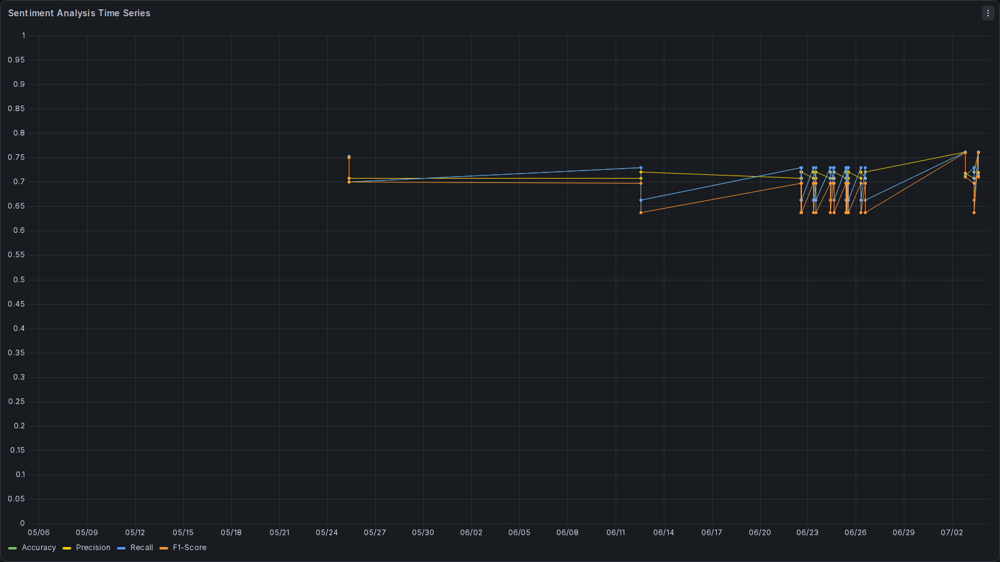
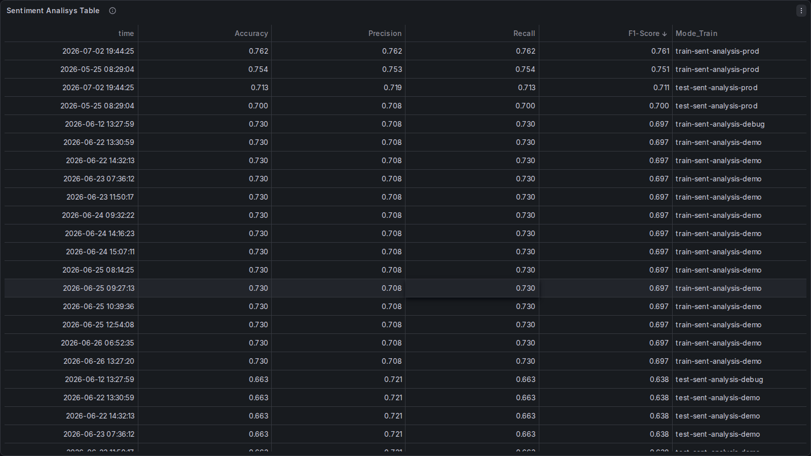
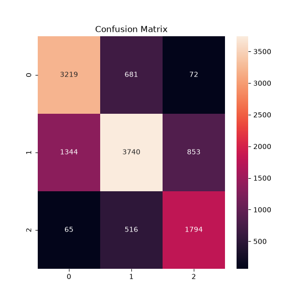
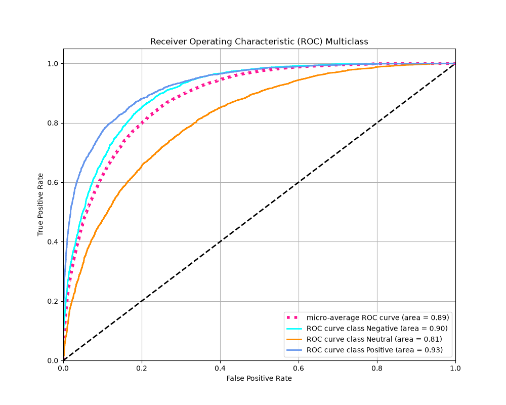

# Progetto: Monitoraggio della reputazione online di un’azienda 

## 1. Guida alla Documentazione

Per comprendere a fondo il progetto, si consiglia di leggere la documentazione nella cartella `docs/` seguendo l'ordine logico:

1. [01 - Architettura del Sistema](docs/01-architecture.md): Visione d'insieme e flusso dati.
2. [02 - Descrizione del progetto.](docs/02-project-overview.md) Scelte progettuali, implementazioni e risultati
3. [03 - Environment](docs/03-environment.md): Setup environment del progetto.
4. [04 - ML Training](docs/04-ml-training.md): Training modello di Sentiment Analysis.
5. [05 - Model Serving](docs/05-model-serving.md): Endpoint FastAPI e Model Serving.
6. [06 - CI & test](docs/06-ci-test.md): Workflow CI di GitHub Actions e Build Template Docker.
7. [07 - CI/CD & Train](docs/07-cicd-train.md): Workflow di CI/CD GitHub Actions e Docker.
8. [08 - Monitoraggio](docs/08-monitoring.md): Dashboard Grafana e logica di alerting.
9. [09 - Schedulazione e Orchestrazione](docs/09-scheduling.md) Retrain automatico e Monitoraggio continuo
10. [10 - Risultati Scelte Future Versioni](docs/10-insights-next-version.md)

## 2. Accesso al workflow di Monitoraggio

## 3. RISULTATI 
In produzione le prestazioni sono stabilmente sopra lo 0.70 (discrete)
su tutte le metriche (accuracy , precision , recall , f1_score).
Avendo poche risorse a disposizione e considerato che le specifiche
non prevedono di ottimizzare le prestazioni del modello si è preferito
dedicare tempo e risorse alla progettazione e orchestrazione del progetto MLops. 

I risultati evidenziano che :

- la modalità di esecuzione "demo" abbassa stabilmente 
le metriche di riferimento (accuracy e f1_score) sotto la soglia critica dello 0.7

- la modalità di esecuzione "prod" eseguita come default dal sistema
di orchestrazione su airflow alza le metriche stabilmente sopra
la soglia stessa.

DETTAGLIO DEI RISULTATI
3.1 Risultati del Monitoraggio: 
   Tra maggio e luglio si osserva una crescita sul set di test di circa $+1.3\%$ 
   in termini di Accuracy e di $+1.1\%$ in termini di F1-Score. 
   Questo dimostra che gli aggiornamenti apportati al training 
   hanno aumentato la capacità predittiva del sistema.
   
3.2 Stabilità sopra la Soglia Critica: 
    sia l'Accuracy che l'F1-Score sul set di test sono stabilmente sopra lo $0.70$ ($71.30\%$ e $71.11\%$). 
   
3.3 Controllo dell'Overfitting: 
    Il divario (generalization gap) 
    tra le metriche di Train e quelle di Test si attesta costantemente intorno al $\approx 5.0\%$. 
    Un gap così ristretto indica che il modello non sta semplicemente "memorizzando" i dati di addestramento, 
    ma mostra un'eccellente capacità di generalizzazione sui dati reali di produzione.
   
   
3.4 Calcolo delle metriche: 
    Il calcolo delle  metriche è stato effettuato con una logica 
    di media weighted-average. Questa scelta è cautelativa, poiché permette all'F1-Score di riflettere l'impatto di eventuali 
    sbilanciamenti tra le classi di sentiment (es. se ci sono molti più testi positivi che negativi), 
    garantendo che lo $0.71$ ottenuto in produzione sia un valore genuino e non gonfiato da una classe dominante.
    Il codice della funzione [compute_metrics](./src/train/metrics.py)
    usa  l'approccio weighted il che è la scelta migliore quando 
    si ha a che fare con dataset sbilanciati.

3.4. Correttezza dei dati: 
    Nel task di classificazione multiclasse a singola etichetta, l'Accuracy 
    coincide matematicamente con il Recall calcolato mediante media weighted.
    L'uguaglianza osservata nel database è quindi un comportamento atteso e conferma la coerenza del calcolo delle metriche, 
    senza costituire da sola una prova della correttezza dell'intera pipeline.

3.5. Conclusione sul Monitoraggio Continuo
   
    Il modello di produzione soddisfa i requisiti operativi principali di un progetto MLops. 
    manutenzione di metriche reali (Test) superiori allo $0.70$.
    Il sistema mostra un trend storico di crescita e un rischio 
    di overfitting ampiamente sotto controllo.
   
    L'infrastruttura di logging su SQLite funziona correttamente 
    e tiene traccia in modo coerente degli esperimenti, 
    fornendo una solida base per audit o report fossero richiesti.
    Possiamo considerare questa milestone(pietra miliare) come un punto d'arrivo stabile e di successo per il ciclo di sviluppo attuale.
   
    Risultati Addestramento Continuo: 
    Dalla sequenza temporale delle metriche (accuracy e f1_score) si nota un abbassamento delle stesse
    sotto la soglia critica ottenuta con un addestramento in modalità demo seguita da un rialzo
    ottenuto con il successivo addestramento eseguito con il dag automatico oppure manualmente
    dall'interfaccia web di github.
   
   
3.6 Analisi della Curva ROC (Multiclass)
    La ROC micro-average riflette le classi più frequenti e 
    segnala quanto è bravo complessivamente il modello nel distinguere la classe corretta da tutte le altre, 
    considerando tutte le predizioni insieme.
    La ROC macro-average mette sullo stesso piano classi frequenti e rare, risultando più informativa 
    quando il dataset è sbilanciato (nel nostro casi lo sbilanciamento è moderato) 
    e segnala quanto è bravo il modello mediamente su ciascuna classe, indipendentemente da quante istanze contiene.

    La curva ROC e i relativi valori di AUC (Area Under the Curve) mostrano le capacità di separazione del modello, ma con differenze nette tra le classi:

    Classe Positive (AUC = 0.93): OTTIMO
    È la classe che il modello riconosce meglio in assoluto. Un valore di 0.93 indica una capacità di discriminazione quasi eccellente.

    Classe Negative (AUC = 0.88): MOLTO BUONO QUASI OTTIMO
    Ottime prestazioni anche qui. Il modello distingue molto bene il sentiment negativo dallo sfondo.

    Classe Neutral (AUC = 0.78):  DISCRETO QUASI BUONO
    È l'anello debole della catena. I testi neutri possono essere ambigui 
    e privi di marcatori lessicali forti, rendendo la classificazione più complessa.

    Micro-average (AUC = 0.85): Conferma che, a livello globale ponderato, il modello ha una stabilità decisamente buona.

3.7 Analisi della matrice di confusione

    la matrice mostra una scomposizione numerica molto chiara del comportamento del classificatore basato sulla mappatura seguente delle classi 
    0 = Negative
    1 = Neutral
    2 = Positive

    I Punti di Forza
    Classe 1 (Neutrale): Ha il numero più alto di predizioni corrette (5336). 
    Il modello ha intercettato molto bene la massa critica di questa classe.

    Classe 2 (Positiva): 
    Ottima precisione di contrasto con la classe opposta. Nota come il modello non scambi quasi mai la classe 2 con la classe 0 
    (solo 3 casi di classe 2 scambiati per 0).

    Il punto di debolezza (Perché l'accuracy si ferma a ~0.71)
    Se guardiamo la riga della Classe 0 (Negativa), notiamo il vero problema del modello attuale:
    Ha predetto correttamente solo 1320 istanze.
    Ha classificato erroneamente ben 2580 istanze negative come 1 (Neutrali).

3.8 Diagnosi : Il modello soffre di un forte bias di "appiattimento" verso la classe neutrale. 
    Tende ad essere troppo conservativo: quando un testo è negativo ma non contiene insulti o parole estremamente marcate, 
    preferisce assegnarlo alla classe Neutra (1) piuttosto che rischiare.

    Questo spiega perfettamente 
    perché l'accuracy globale si ferma intorno al 71%: 
    quasi la metà dei messaggi negativi viene "assorbita" dal limbo dei messaggi neutri.

3.9 Report Finale di Sintesi

  Capacità Discriminante Elevata: Le curve ROC dimostrano che l'architettura scelta ha un potenziale eccellente 
  (AUC globale a 0.85 e picchi di 0.93 sui positivi).
  I pattern linguistici del sentiment estremo (positivo/negativo) sono stati appresi con successo.

  Sbilanciamento del Compromesso (Bias Neutrale): 
  Il limite attuale dello 0.71 di accuracy non è dovuto a un fallimento strutturale del modello, ma a una specifica debolezza nella separazione tra la classe Negativa e la classe Neutrale. 
  Il modello tende a classificare i testi negativi sfumati come neutri.

  Valore del Lavoro Svolto: 
  I grafici confermano che è stato ottenuto un classificatore solido e utilizzabile in produzione, 
  che non commette quasi mai l'errore grave di scambiare un contenuto chiaramente positivo per negativo (e viceversa). 

## 5. Grafici Monitoraggio

.

.

## 6. Grafici Addestramento

.

.

## 7. Specifiche iniziali del Progetto

Monitoraggio della reputazione online di un’azienda
MachineInnovators Inc. è leader nello sviluppo di applicazioni di machine learning scalabili e pronte per la produzione. Il focus principale del progetto è integrare metodologie MLOps per facilitare lo sviluppo, l'implementazione, il monitoraggio continuo e il retraining dei modelli di analisi del sentiment. L'obiettivo è abilitare l'azienda a migliorare e monitorare la reputazione sui social media attraverso l'analisi automatica dei sentiment.

Le aziende si trovano spesso a fronteggiare la sfida di gestire e migliorare la propria reputazione sui social media in modo efficace e tempestivo. Monitorare manualmente i sentiment degli utenti può essere inefficiente e soggetto a errori umani, mentre la necessità di rispondere rapidamente ai cambiamenti nel sentiment degli utenti è cruciale per mantenere un'immagine positiva dell'azienda.

Benefici della Soluzione

Automazione dell'Analisi del sentiment: Implementando un modello di analisi del sentiment, MLOps Innovators Inc. automatizzerà l'elaborazione dei dati dai social media per identificare sentiment positivi, neutrali e negativi. Ciò permetterà una risposta rapida e mirata ai feedback degli utenti.
Monitoraggio Continuo della Reputazione: Utilizzando metodologie MLOps, l'azienda implementerà un sistema di monitoraggio continuo per valutare l'andamento del sentiment degli utenti nel tempo. Questo consentirà di rilevare rapidamente cambiamenti nella percezione dell'azienda e di intervenire prontamente se necessario.
Retraining del Modello: Introdurre un sistema di retraining automatico per il modello di analisi del sentiment assicurerà che l'algoritmo si adatti dinamicamente ai nuovi dati e alle variazioni nel linguaggio e nei comportamenti degli utenti sui social media. Mantenere alta l'accuratezza predittiva del modello è essenziale per una valutazione corretta del sentiment.
Dettagli del Progetto

Fase 1: Implementazione del Modello di Analisi del sentiment
Modello: Utilizzare un modello pre-addestrato per un’analisi del sentiment in grado di classificare testi dai social media in sentiment positivo, neutro o negativo. Servirsi di questo modello: https://huggingface.co/cardiffnlp/twitter-roberta-base-sentiment-latest
Dataset: Utilizzare dataset pubblici contenenti testi e le rispettive etichette di sentiment.
Fase 2: Creazione della Pipeline CI/CD
Pipeline CI/CD: Sviluppare una pipeline automatizzata per il training del modello, i test di integrazione e il deploy dell'applicazione su HuggingFace.
Fase 3: Deploy e Monitoraggio Continuo
Deploy su HuggingFace (facoltativo): Implementare il modello di analisi del sentiment, inclusi dati e applicazione, su HuggingFace per facilitare l'integrazione e la scalabilità.
Sistema di Monitoraggio: Configurare un sistema di monitoraggio per valutare continuamente le performance del modello e il sentiment rilevato.
Consegna
Codice Sorgente: Repository pubblica su GitHub con codice ben documentato per la pipeline CI/CD e l'implementazione del modello. La consegna vera e propria dovrà avvenire mediante un notebook google colab con al suo interno il link al repository GitHub.
Documentazione: Descrizione delle scelte progettuali, delle implementazioni e dei risultati ottenuti durante il progetto.
Motivazione del Progetto

L'implementazione di un modello per l'analisi del sentiment consente a MLOps Innovators Inc. di migliorare significativamente la gestione della reputazione sui social media. Automatizzando l'analisi del sentiment, l'azienda potrà rispondere più rapidamente alle esigenze degli utenti, migliorando la soddisfazione e rafforzando l'immagine dell'azienda sul mercato. Con questo progetto, MLOps Innovators Inc. promuove l'innovazione nel campo delle tecnologie AI, offrendo soluzioni avanzate e scalabili per le sfide moderne di gestione della reputazione aziendale.

 

