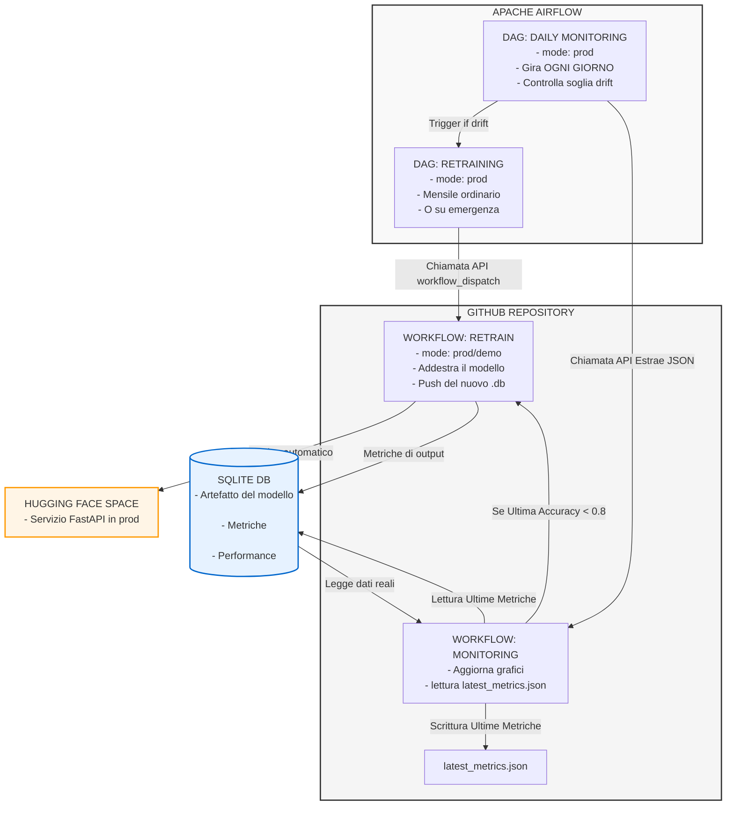

                 
                 

# MACHINE INNOVATION - ARCHITETTURA

## 1. Schema Architettura `01-architecture.md`

 

## 2. DESCRIZIONE ARCHITETTURA E WORKFLOW

                                WORKFLOW RETRAIN AUTOMATICO (mode=prod/demo default=prod)
Esecuzione solo con workflow_dispatch (manuale o attivato da Airflow).
Il riaddestramento di un modello di Machine Learning è un'operazione costosa in termini di tempo e risorse (computazione, GPU, ecc.). Non deve mai scattare in automatico a ogni push.
Pertanto nel workflow CI-CD è stato aggiunta l'esecuzione manuale/automatico del job traon separatao da test e deploy.

                               WORKFLOW MONITORING CONTINUO (mode=prod/demo default=prod)
Esecuzioe con push su main, manuale (workflow_dispatch), o schedulato da Airflow.
Questo workflow fa un git commit e git push automatico dei grafici e delle metriche sul main, tenerlo isolato sul push del main evita i "loop" infiniti di esecuzione. 
 Airflow lo chiama subito dopo che il modello è stato aggiornato e i nuovi dati di produzione sono pronti.

                              WORKFLOW CI-CD CONTINUO
Viene eseguito ad ogni modifica (sia push che pull_request).
Deve girare sempre per assicurarsi che nessuno rompa il codice.

                              WORKFLOW CI MANUALE
Eseguito solo in manuale tramite workflow_dispatch in modo da non diventare 
ridondante rispetto al flusso CI CD ma rimane visibile nella scheda "Actions" di GitHub sul branch main, pronto per essere testato manualmente all'occorrenza.

                             ORCHESTRAZIONE WORKFLOW CON AIRFLOW
Airflow viene usato come orchestratore per il retraining (magari basato su una pianificazione temporale o sul rilevamento di data drift) è la scelta ideale. Airflow chiama le API di GitHub per attivare il workflow(retrain automatico e/o monitoraggio) tramite il workflow_dispatch.
Vedere la sezione dedicata alla schedulazione per i dettagli.

                             RIEPILOGO
I 4 flussi interagiscono con i seguenti step:
STEP1: Airflow esegue mensilmente un Retrain automatico (tramite API).
        Il Retrain genera i nuovi file metrics.db e i grafici png.
        Viene eseguito il push deuìi files db e png.

STEP2: Il push attiva il Test Deploy per validare l'integrità del sistema.

STEP3: Se i test passano, il Monitoring si attiva, aggiorna i grafici di Grafana, 
       scatta gli screenshot e consolida la dashboard.
