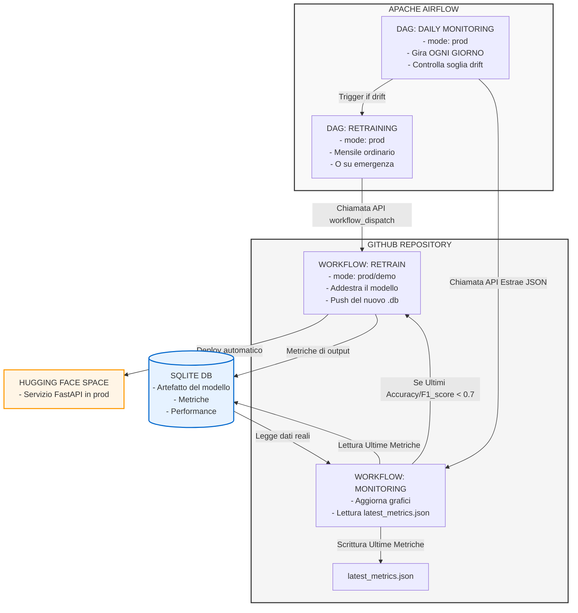

  # MACHINE INNOVATION - ARCHITETTURA

## 1. Schema dell'Architettura `01-architecture.md`

```mermaid
graph TB
    %% Sotto-grafico Airflow
    subgraph AIRFLOW [APACHE AIRFLOW]
        DAG1[DAG: RETRAINING<br>- mode: prod<br>- Mensile ordinario<br>- O su emergenza]
        DAG2[DAG: DAILY MONITORING<br>- mode: prod<br>- Gira OGNI GIORNO<br>- Controlla soglia drift]
        DAG2 -->|Trigger if drift| DAG1
    end

    %% Sotto-grafico GitHub
    subgraph GITHUB [GITHUB REPOSITORY]
        W_RETRAIN[WORKFLOW: RETRAIN<br>- mode: prod/demo<br>- Addestra il modello<br>- Push del nuovo .db]
        W_MONITOR[WORKFLOW: MONITORING<br>- Aggiorna grafici<br>- Lettura latest_metrics.json]
        W_MONITOR -->|Scrittura Ultime Metriche| latest_metrics.json
        W_MONITOR -->|Se Ultimi Accuracy/F1_score < 0.7| W_RETRAIN
    end

    %% Elementi Esterni
    HF[HUGGING FACE SPACE<br>- Servizio FastAPI in prod]
    DB[(SQLITE DB<br>- Artefatto del modello<br>- Metriche<br>- Performance)]

    %% Connessioni e Flussi
    DAG1 -->|Chiamata API workflow_dispatch| W_RETRAIN
    DAG2 -->|Chiamata API Estrae JSON| W_MONITOR
    
    W_RETRAIN -->|Deploy automatico| HF
    W_RETRAIN -->|Metriche di output| DB
    W_MONITOR -->|Lettura Ultime Metriche| DB
    DB -->|Legge dati reali| W_MONITOR

    %% Stili grafici
    style AIRFLOW fill:#f9f9f9,stroke:#333,stroke-width:2px
    style GITHUB fill:#f5f5f5,stroke:#333,stroke-width:2px
    style HF fill:#fff5e6,stroke:#ff9900,stroke-width:2px
    style DB fill:#e6f2ff,stroke:#0066cc,stroke-width:2px
```

2. DESCRIZIONE ARCHITETTURA E WORKFLOW
A. Workflow Retrain Automatico (mode=prod/demo, default=prod)
Attivazione: Esecuzione solo tramite workflow_dispatch (manuale o attivata programmaticamente da Airflow).

Descrizione: Il riaddestramento di un modello di Machine Learning è un'operazione costosa in termini di tempo e risorse (computazione, GPU, ecc.) e non deve mai scattare in automatico a ogni push. Pertanto, nella pipeline di CI/CD, l'esecuzione del job di training è stata isolata e separata dalle fasi standard di test e deploy.

B. Workflow Monitoring Continuo (mode=prod/demo, default=prod)
Attivazione: Esecuzione automatica su push verso il branch main, attivazione manuale (workflow_dispatch), o schedulazione programmata tramite Airflow.

Descrizione: Questo workflow effettua un git commit e un git push automatico dei grafici e delle metriche aggiornate direttamente sul branch main. Mantenerlo isolato rispetto al normale flusso di push evita loop infiniti di esecuzione della pipeline. Il DAG giornaliero di Airflow lo invoca per leggere l'ultimo valore di Accuracy memorizzato nel sistema e confrontarlo con una soglia critica impostata a 0.7. Un valore più conservativo sarebbe 0.8, ma allo stato attuale si è preferito mantenere una soglia più tollerante per evitare retraining troppo frequenti ed economici. Le specifiche attuali non richiedono l'ottimizzazione stringente delle metriche, dando priorità alla stabilità e alla robustezza dell'infrastruttura MLOps complessiva. Le versioni future potranno seguire le indicazioni della sezione insights per incrementare le performance predittive.

C. Workflow CI/CD Continuo
Attivazione: Viene eseguito automaticamente ad ogni modifica del codice (sia su push che su pull_request).

Descrizione: Questo workflow garantisce l'integrità del codice applicativo, assicurando che nessuna nuova modifica introduca regressioni o blocchi critici (breaking changes).

D. Workflow CI Manuale
Attivazione: Eseguito esclusivamente in modalità manuale tramite workflow_dispatch.

Descrizione: Ideato per non sovraccaricare o duplicare i flussi standard di CI/CD. Rimane visibile e accessibile nella scheda "Actions" di GitHub sul branch main, pronto per essere avviato dai componenti del team in caso di test estemporanei.

E. Orchestrazione dei Workflow con Apache Airflow
Airflow funge da orchestratore centralizzato per le attività di retraining (basato su una pianificazione mensile ricorrente o sul rilevamento di data drift su base quotidiana). Airflow comunica con le API di GitHub per innescare i rispettivi workflow (retrain automatico e/o monitoring) sfruttando l'evento workflow_dispatch. Per maggiori dettagli tecnici, consultare la sezione dedicata alla schedulazione.

3. RIEPILOGO DEI FLUSSI (STEP-BY-STEP)
STEP 1: Airflow avvia il processo di Retrain automatico mensile (o su emergenza via API). Il processo genera un file aggiornato metrics.db contenente i valori di accuracy, precision, recall, f1_score e il relativo timestamp. Al termine, viene eseguito il push dei file metrics.db, roc_curve.png e confusion_matrix.png nel repository.

STEP 2: Il push degli artefatti aggiornati attiva automaticamente il workflow di Test Deploy per convalidare l'integrità dell'applicazione e del modello appena generato.

STEP 3: Una volta superati i test di validazione, si attiva la fase di Monitoring che aggiorna i grafici su Grafana, cattura gli screenshot aggiornati e consolida i dati storici all'interno della dashboard di controllo.               
                 

