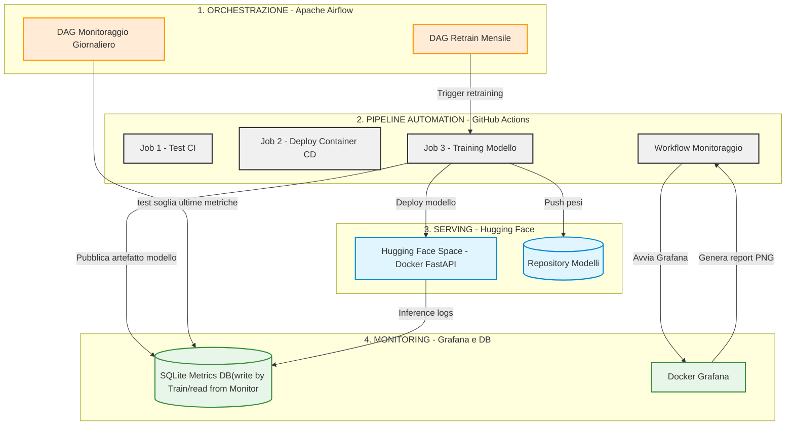

# MACHINE INNOVATION - PROJECT OVERVIEW

Questo documento fornisce una descrizione ad alto livello dell'architettura e dei flussi di lavoro del progetto Machine Innovation, evidenziando le interazioni, i trigger e lo scambio di dati tra i vari componenti del sistema.

1. TRAINING DEL MODELLO (FastText / RoBERTa)

Machine Innovation è basato su un modello di NLP per la Sentiment Analysis.

Modello utilizzato: twitter-roberta-base-sentiment-latest (inizializzato su architettura RoBERTa/FastText) ottimizzato per il riconoscimento del sentiment su testi social.

Dataset: tweeteval (specifico per compiti di classificazione di tweet).

Modalità di Esecuzione:

prod (Produzione): Addestramento completo, lento ma accurato. Garantisce l'affidabilità del modello finale da distribuire agli utenti.

debug (Sviluppo/Demo/Test): Addestramento ultrarapido (es. pochissimi step/epoche) ideale per verificare l'integrità del codice nel flusso CI/CD, per demo rapide o test d'integrazione senza spreco di risorse computazionali.

2. MODEL SERVING (Hugging Face & FastAPI)

Il modello viene esposto tramite API per consentire l'inferenza in tempo reale.

Hosting: Hugging Face Space configurato per far girare un container Docker con un servizio FastAPI.

 Per massimizzare l'efficienza è stato scelto il Disaccoppiamento Codice-Modello:

HF Space (App): Contiene esclusivamente il codice dell'applicazione FastAPI e le logiche di inferenza.

Model Repository (Dati): I pesi del modello addestrato (file di grandi dimensioni soggetti a Continuous Deployment) risiedono in un repository Git separato. All'avvio dell'applicazione o al deploy, FastAPI scarica l'ultima versione del modello da questo repository dedicato.

3. WORKFLOW CICD TRAIN / GitHub Actions

La pipeline di automazione su GitHub gestisce il ciclo di vita del codice e del modello attraverso 2 workflow e 4 Job:

Workflow1 Machine Innovation CI
Job 1 (CI - Test): Esegue il linting del codice e i test unitari e d'integrazione (esecuzione solo manuale alla bisogna).

Workflow2 Machine Innovation CICD TRAIN
Job 1 (CI - Test): Esegue i test unitari e d'integrazione ad ogni push o pull_request sul branch main.

Job 2 (CD - Deploy): Costruisce il container Docker e aggiorna il servizio su Hugging Face Space. Viene eseguito anch'esso ad ogni push/PR su main.

Job 3 (Train - Solo manuale/dispatch): Non parte mai in automatico al push (per evitare spreco di risorse su modifiche minori del codice). Può essere avviato solo manualmente tramite workflow_dispatch o da API esterne (Airflow).

Fase finale: Una volta concluso il training con successo, questo job invia un comando di riavvio (restart) al container di Hugging Face per forzare il caricamento del nuovo modello appena addestrato.

4. WORKFLOW DI MONITORAGGIO & GRAFANA

Garantisce la trasparenza e la tracciabilità delle performance dei modelli storici e correnti.

Trigger: Si attiva ad ogni push diretto su main (escludendo le pull_request per evitare ridondanze in fase di sviluppo).

Funzionamento: 1.  Istanzia un container Docker temporaneo con Grafana.
2.  Carica l'ultimo database SQLite (metrics.db) generato dall'ultimo addestramento.
3.  Genera automaticamente gli screenshot in formato .png dei grafici chiave della dashboard.
4.  Esporta un file(latest_metrics.json) consolidato contenente le ultime metriche registrate (accuratezza, loss, f1-score).

5. SCHEDULAZIONE & ORCHESTRAZIONE (Apache Airflow)

Airflow è l'orchestratore dell'infrastruttura MLOps, gestendo le pianificazioni temporali e le logiche di reazione tramite due DAG (diretti alle API di GitHub):

DAG 1: Retrain Mensile (mlops_ci_cd_train_monthly)
Schedulazione: Gira in automatico il 1° giorno di ogni mese alle 00:00.
Azione: Effettua una chiamata API a GitHub Actions per avviare il Job Train in modalità prod.

DAG 2: Monitoraggio Giornaliero & Model Drift (mlops_metrics_monitoring_daily)

Schedulazione: Gira ogni giorno alle 08:40.
Azione: Scarica ed esamina il file delle ultime metriche generate.

Gestione del Drift: Valuta l'accuratezza dell'ultimo modello. 
Se l'accuratezza scende sotto la soglia di guardia di 0.80 ($Accuracy < 0.80$), 
Airflow rileva un Model Drift (deterioramento delle prestazioni) e anticipa immediatamente l'avvio del Retrain chiamando il workflow di train su GitHub, senza aspettare la fine del mese.

6. COLLEGAMENTI E FLUSSO LOGICO DEI DATI

Raccolta Dati & Monitoraggio (Airflow giornaliero): 
Airflow monitora le metriche. Se l'accuratezza è ottimale ($>0.80$), 
il sistema rimane silente.

Rilevamento del Drift o Scadenza Mensile: 
Se scatta il 1° del mese o se l'accuratezza scende sotto $0.80$, Airflow lancia il segnale d'allarme via API.

Esecuzione del Training (GitHub Actions): 
GitHub riceve l'input e avvia l'addestramento. 
Vengono generati il nuovo modello e il file metrics.db.

Deploy & Aggiornamento (FastAPI & Grafana): * I pesi vengono inviati al repository modelli.

Il container FastAPI viene riavviato per caricare il nuovo file.

Il workflow di monitoraggio si attiva sul push di completamento, rigenerando i grafici PNG della dashboard di Grafana per mostrare i miglioramenti del nuovo modello appena distribuito.