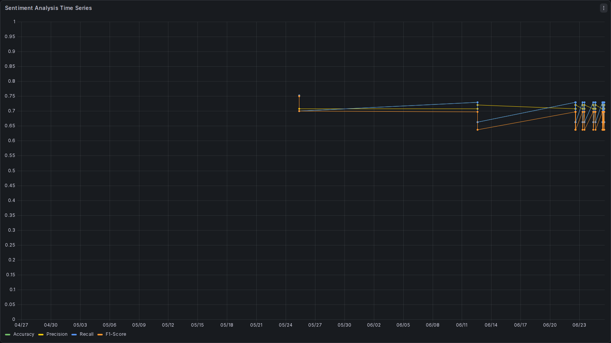
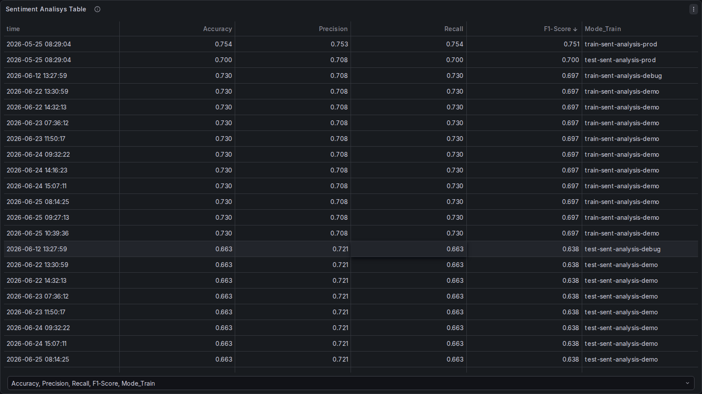

                             
                             # MACHINE INNOVATION MONITORING

## 1. `07-monitoring.md`
Il monitoring implementa l'osservabilità del sistema. 
Qui viene spiegato cosa viene tracciato su Grafana e come accedere alle dashboard.

```markdown
## 2.  Monitoraggio e Osservabilità

Il sistema monitora costantemente le performance dell'API (latenza, numero di richieste) e le performance del modello (data drift, distribuzione delle predizioni).

## 3.  Stack Tecnologico
* **Rilevamento metriche:** FastAPI Machine Innovation
* **Data Source:** Sqlite
* **Visualizzazione:** Grafana

## 4.  Dashboard di Grafana
Abbiamo configurato una dashboard principale per il controllo della produzione.

* **Link alla Dashboard Live:** [Grafana Cloud Instance](Non disponibile)
* **Backup JSON della Dashboard:** [grafana_dashboard.json](../monitoring/latest_metrics.json)

## 5.  Screenshot della Dashboard Attuale
Ecco come appare il monitoraggio delle metriche:




## 6.  Alerting
Gli alert su Airflow sono impostati per attivare il retraing se:
* L'accuracy è inferiore a **0.8** .

## 7. Manutenzione del sistema
per fare pulizia sul disco e cancellare i vecchi container

# Quando si spegne il container cancelliamo il volume
# Non perdiamo nulla perchè abbiamo salvato la dashboard
# sotto grafana-provisioning e la script install_db.sh
# aggiorna il files metrics.db ad ogni esecuzione.
docker compose down -v
docker system prune -a --volumes -f

# 8. Mancato accesso alla dashboard (admin/admin)
In caso di mancato accesso a grafana sul browser
Ad esempio una verifica sul log potrebbe evidenziare
il lock sul database sqlite.
docker logs grafana

eseguire in ordine e riprovare ad accedere
cd monitoring/
docker compose down -v
docker system prune -f
docker compose up -d
docker logs grafana


